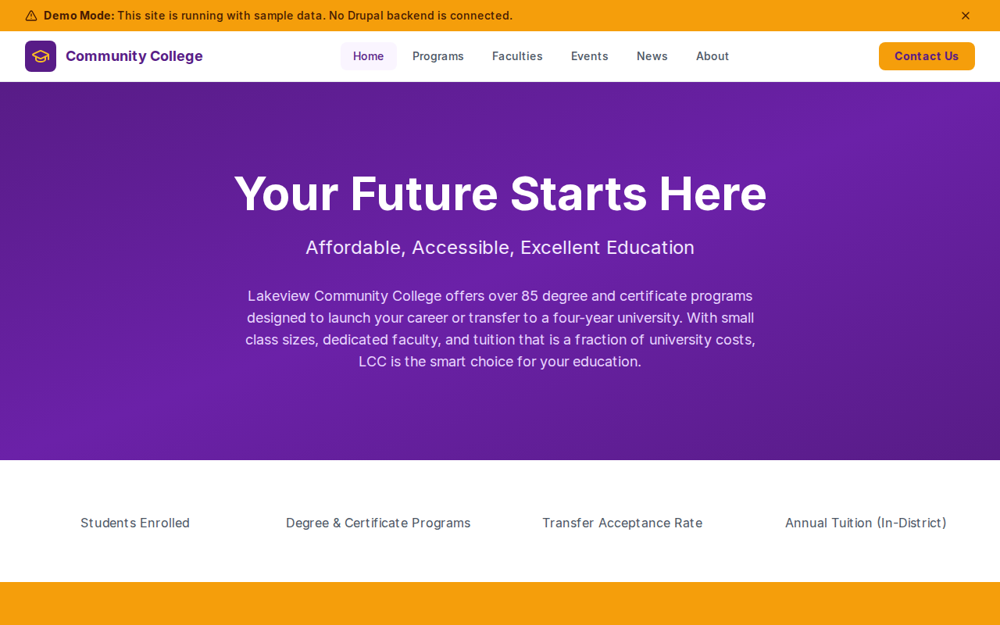

# Decoupled Community College

A community college website starter template for Decoupled Drupal + Next.js. Built for two-year colleges, technical schools, and community education institutions.



## Features

- **Academic Programs** - Associate degrees, certificates, transfer pathways, and workforce training with tuition estimates and career outcomes
- **Faculty Directory** - Instructor profiles with credentials, office hours, and department affiliations
- **College Events** - Open houses, career fairs, commencement ceremonies, and campus activities
- **College News** - Campus announcements, student success stories, faculty spotlights, and athletics coverage
- **Modern Design** - Clean, accessible UI optimized for community college content

## Quick Start

### 1. Clone the template

```bash
npx degit nextagencyio/decoupled-community-college my-college
cd my-college
npm install
```

### 2. Run interactive setup

```bash
npm run setup
```

This interactive script will:
- Authenticate with Decoupled.io (opens browser)
- Create a new Drupal space
- Wait for provisioning (~90 seconds)
- Configure your `.env.local` file
- Import sample content

### 3. Start development

```bash
npm run dev
```

Visit [http://localhost:3000](http://localhost:3000)

---

## Manual Setup

<details>
<summary>Click to expand manual setup steps</summary>

### Authenticate with Decoupled.io

```bash
npx decoupled-cli@latest auth login
```

### Create a Drupal space

```bash
npx decoupled-cli@latest spaces create "My Community College"
```

Note the space ID returned. Wait ~90 seconds for provisioning.

### Configure environment

```bash
npx decoupled-cli@latest spaces env 1234 --write .env.local
```

### Import content

```bash
npm run setup-content
```

This imports:
- Homepage with enrollment statistics and call to action
- 3 Academic Programs (Nursing, Cybersecurity, Welding Technology)
- 3 Faculty Members with credentials and office hours
- 3 College Events (Open House, Career Fair, Commencement)
- 3 News Articles (Grant award, student success story, esports championship)
- 2 Static Pages (About, Admissions & Enrollment)

</details>

## Content Types

### Academic Program
- **Program Type** - Associate Degree, Certificate, Transfer Pathway, Workforce Training, Continuing Education
- **Department** - Business & Technology, Health Sciences, Liberal Arts, Science & Math, Skilled Trades, Public Safety
- **Credential** - Degree or certificate earned upon completion
- **Duration / Credits** - Program length and total credit hours
- **Tuition Estimate** - Estimated cost for in-district students
- **Start Dates** - When the program accepts new students
- **Career Outcomes** - Jobs graduates can pursue
- **Program Image** - Photo representing the program

### Faculty Member
- **Position Title** - Academic rank and role
- **Department** - Associated department(s)
- **Email / Phone** - Contact information
- **Office Location / Hours** - Where and when to find the instructor
- **Education** - Degrees and institutions
- **Photo** - Faculty headshot

### College Event
- **Event Date / End Date** - Event timing
- **Location** - Where the event takes place
- **Event Category** - Open House, Workshop, Student Life, Career Fair, Graduation, Athletic Event
- **Registration URL** - Link to sign up
- **Cost** - Admission price or free
- **Event Image** - Promotional photo

### News
- **News Category** - Campus News, Student Success, Faculty Spotlight, Athletics, Press Release
- **Publish Date** - When the article was published
- **Author** - Writer or department
- **Summary** - Brief excerpt
- **Featured Image** - Article image

## Customization

### Colors & Branding
Edit `tailwind.config.js` to customize colors, fonts, and spacing.

### Content Structure
Modify `data/community-college-content.json` to add or change content types and sample content.

### Components
React components are in `app/components/`. Update them to match your design needs.

## Demo Mode

Demo mode allows you to showcase the application without connecting to a Drupal backend.

### Enable Demo Mode

```bash
NEXT_PUBLIC_DEMO_MODE=true
```

### Removing Demo Mode

1. Delete `lib/demo-mode.ts`
2. Delete `data/mock/` directory
3. Delete `app/components/DemoModeBanner.tsx`
4. Remove `DemoModeBanner` from `app/layout.tsx`
5. Remove demo mode checks from `app/api/graphql/route.ts`

## Deployment

### Vercel (Recommended)
[](https://vercel.com/new/clone?repository-url=https://github.com/nextagencyio/decoupled-community-college)

### Other Platforms
Works with any Node.js hosting platform that supports Next.js.

## Documentation

- [Decoupled.io Docs](https://www.decoupled.io/docs)
- [Next.js Documentation](https://nextjs.org/docs)
- [Drupal GraphQL](https://www.decoupled.io/docs/graphql)

## License

MIT
